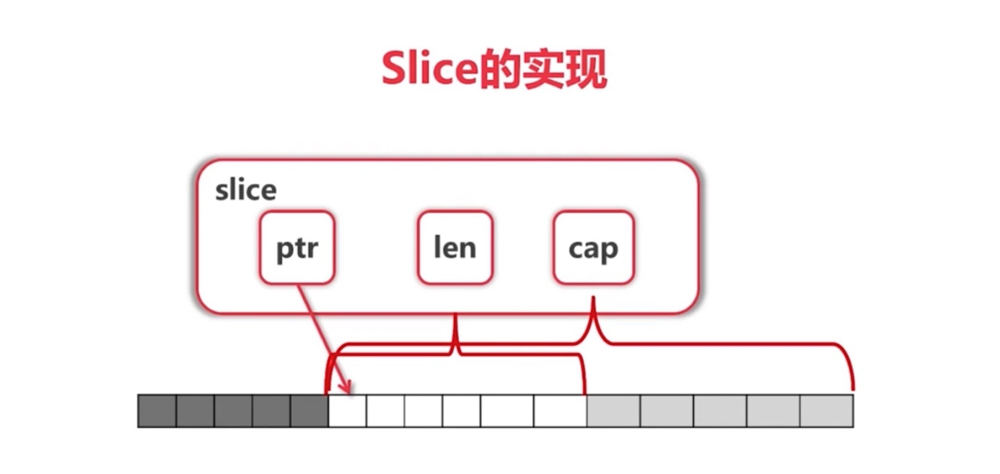

# Second Part

## array

```go
package main
import "fmt"
func main(){
var arr [2]int
arr3 := [...]int {2,3,4}
fmt.Println(arr, arr3)
}
```
range -> iterate the array
```go
package main
import "fmt"
func a (){
var arr [4]int
for _,v := range arr{
    fmt.Println(v)
}
}
```
array is value type ([10]int != [20]int)  
invoke func() will copy the value of the array
user &pointer to change the invoked value

## slice (usage rate more than array)

slice = arr[x:x]  
slice is a view of a array  
```go
package main
import "fmt"
func s() {
	arr := [...]int{0,1,2,3,4,5,6,7}
	s1 := arr[2:6]
	s2 := s1[3:5]
	fmt.Println(s1) // [2,3,4,5]
	fmt.Println(s2) // [5,6]
}
```

the len of s1 is 4, but the capacity is 6, so we can get s2  
 
### append element to slice

- if the `cap` is full, the system will revoke a huge array
- must receive the return value of `append()`


## map

- create make(map[string]int) 
- get value: m["key"]
- map reserves value without order
- except for slice,map,function, other types can function as map's key


## rune

- rune相当于char在go语言中的实现
- 使用range 遍历 pos，rune对
- 使用utf8.RuneCountInString获取字符数量
- 使用len获得字节长度
- 使用[]byte获得字节
